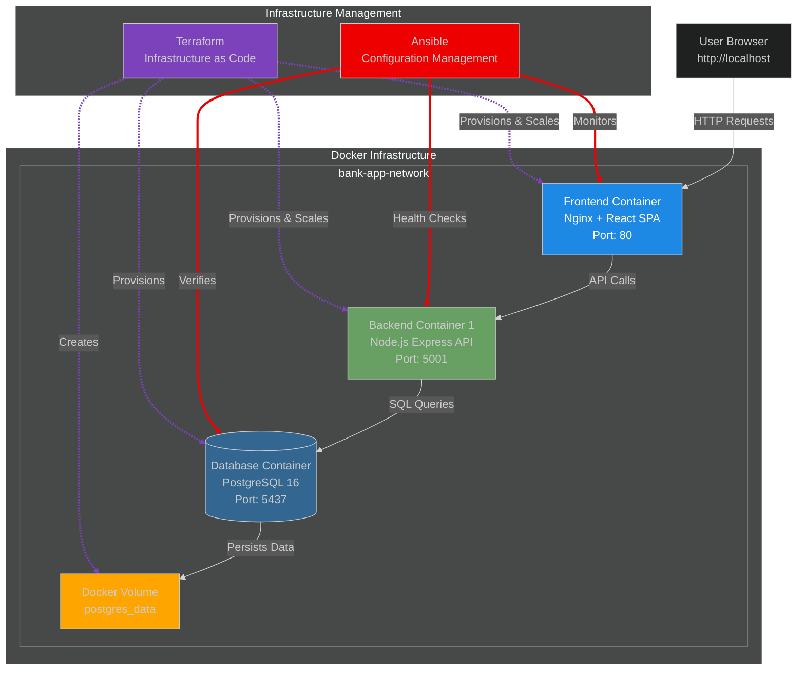
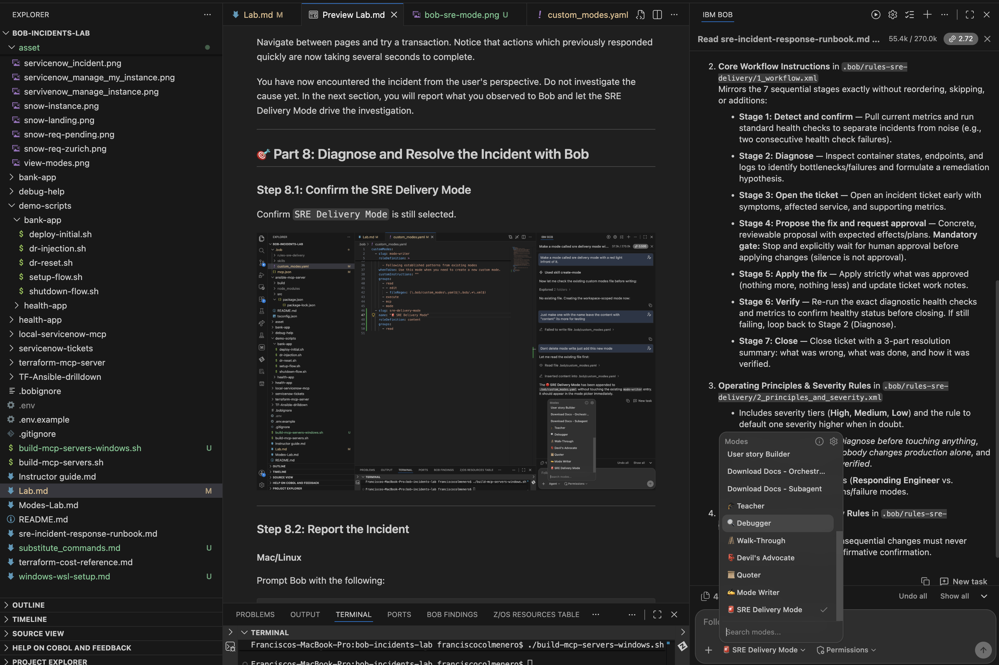
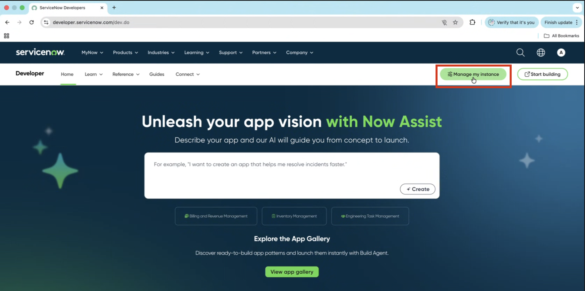
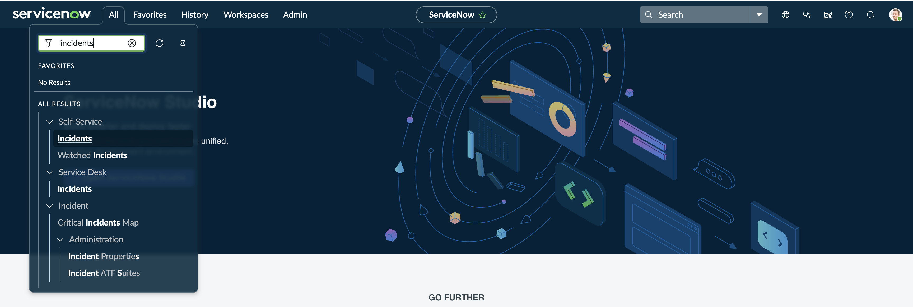
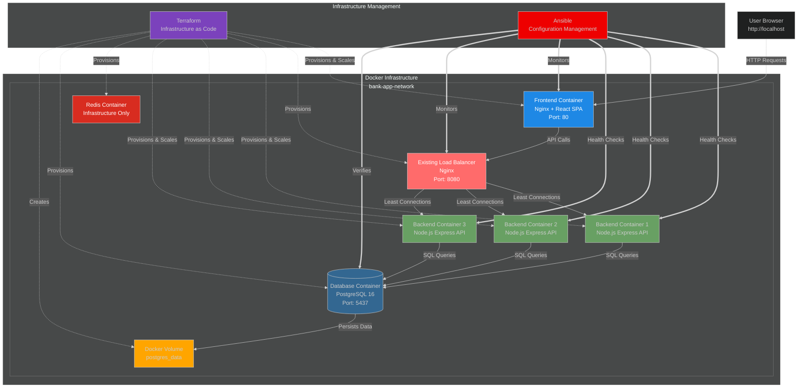

# 🎓 Lab Walkthrough: SDLC Incident Management with Bob

## 📋 Lab Overview

In this hands-on lab, you will deploy and explore a working Bank App, teach Bob your team's SRE workflow and technical standards, and use Bob to manage planned infrastructure work, infrastructure drift, and a simulated production incident.

**Learning Objectives:**

1. Understand the application architecture and normal operation
2. Create an SRE Delivery Mode from an existing runbook
3. Give Bob reusable Ansible, Terraform, and ServiceNow guidance
4. Build and troubleshoot Redis infrastructure with Terraform
5. Detect and reconcile infrastructure drift
6. Diagnose and resolve a simulated application incident
7. Track each issue safely in a shared ServiceNow instance
8. Verify and document the completed remediation

---

## 🏗️ Application Architecture



**Infrastructure Management:**

- **Terraform** provisions the Docker network, containers, storage, and backend replicas.
- **Ansible** runs application health checks and gathers diagnostic information.
- **ServiceNow** records findings, actions, approvals, and resolution details.

---

## 🛠️ Part 1: Environment Setup

### Step 1.1: Create the Lab Workspace

1. At the top of Bob, select **File > Open Folder**.
2. Create or select a parent folder where you want to store the lab, such as `bob-labs`.
3. Open the selected folder in Bob.

This is the parent folder where the lab repository will be cloned.

---

### Step 1.2: Clone the Lab Repository

1. At the top of Bob, select **Terminal > New Terminal**.

   You can also use the terminal shortcut:

   - **macOS:** `Command + backtick`
   - **Windows/Linux:** `Control + backtick`

2. In the Bob terminal, run:

```bash
git clone https://github.com/fcolmenero15/bob-incidents-lab.git
```

3. Wait for the repository to finish cloning.

---

### Step 1.3: Open the Cloned Repository

1. At the top of Bob, select **File > Open Folder** again.
2. Navigate into the parent folder you selected earlier.
3. Select the newly cloned repository folder "bob-incidents-lab".
4. Open that folder as the Bob workspace.

> **Important:** Open the cloned repository folder itself, not the parent folder where it was cloned.

The repository files and folders should now appear directly in the Bob file explorer. Confirm that you can see items such as:

- `.bob`
- `demo-scripts`
- `Lab.md`

These items confirm that Bob is open at the root of the cloned repository.

---

### Step 1.4: Verify Prerequisites

Open a new terminal in the cloned repository and check that the required tools are installed:

```bash
docker ps
terraform version
ansible --version
node --version
```

Docker should return either running containers or an empty list. Terraform, Ansible, and Node.js should each return a version.

If any tools are missing, install them using the instructions for your operating system below.

#### macOS

```bash
brew install colima docker
brew tap hashicorp/tap
brew install hashicorp/tap/terraform
brew install ansible
brew install node

# Start the Docker runtime
colima start

docker pull postgres:16-alpine
docker pull node:20-alpine
docker pull nginx:alpine
```

Colima provides the local container runtime used by the Docker CLI.

#### Windows

Using `winget` from PowerShell:

```powershell
winget install Docker.DockerDesktop
winget install Hashicorp.Terraform
winget install OpenJS.NodeJS.LTS

docker pull postgres:16-alpine
docker pull node:20-alpine
docker pull nginx:alpine
```

Start **Docker Desktop** after installation. Docker Desktop provides the Docker runtime on Windows.

> **Note:** Ansible is designed for Unix-like environments. To use Ansible you need to go through WSL.

#### Linux (Ubuntu/Debian)

```bash
sudo apt update
sudo apt install -y docker.io ansible nodejs npm

# Start Docker
sudo systemctl enable --now docker

docker pull postgres:16-alpine
docker pull node:20-alpine
docker pull nginx:alpine
```

Install Terraform using HashiCorp's package repository if it is not already available on your system. Docker Engine runs natively on Linux, so Colima or Docker Desktop is not required.

---

### Step 1.5: Confirm the Environment

After installation and starting your Docker runtime, verify everything again:

```bash
docker ps
terraform version
ansible --version
node --version
```

Docker should return either running containers or an empty list. Terraform, Ansible, and Node.js should each return a version.

---

### Step 1.6: Configure ServiceNow Credentials

Your instructor will provide credentials for the shared ServiceNow PID instance.

Add them to the root `.env` file:

```text
SERVICENOW_INSTANCE=dev12345
SERVICENOW_USERNAME=
SERVICENOW_PASSWORD=
```

asset/snow-instance.png

---

### Step 1.7: Build the MCP Servers

#### Mac/Linux

Run the setup script:

```bash
./build-mcp-servers.sh
```

#### Windows

Run the setup script:

```bash
./build-mcp-servers-windows.sh
```

The lab uses three MCP servers:

- **ServiceNow MCP** for creating, retrieving, updating, and closing incidents
- **Ansible MCP** for health checks and diagnostics - Skipped for Windows
- **Terraform MCP** for validating, planning, and applying infrastructure changes

The MCP configuration is stored in [`.bob/mcp.json`](.bob/mcp.json). Update its absolute paths for your local environment, then confirm all three MCP servers show a green status in Bob.

asset/bob-mcp.png

---


## 🏦 Part 2: Deploy and Explore the Working Application

### Step 2.1: Deploy the Application

Deploy the healthy, low-traffic starting environment:

```bash
./demo-scripts/bank-app/deploy-initial.sh
```

The script initializes Terraform, sets `backend_replicas = 1`, deploys the application, and verifies service health.

**Initial infrastructure:**

- Docker network
- PostgreSQL database with persistent storage
- One backend API container
- Existing Nginx load balancer
- React frontend served by Nginx

**Expected result:**

```text
Application Status:
• Frontend: http://localhost
• Backend: http://localhost:5001
• Database: localhost:5437
• Backend replicas: 1
• Status: Healthy
```

---

### Step 2.2: Explore the Bank Application

Open [the Bank App](http://localhost) and confirm:

- Pages load in less than one second
- Transactions complete normally
- No errors or timeouts appear
- The application is healthy before any changes are introduced

---

## 🧑‍🏫 Part 3: Create the SRE Delivery Mode

### Step 3.1: Look over the Runbook

The SRE runbook describes how the team diagnoses issues, requests approval, verifies changes, and documents work. Bob will turn this existing process into a reusable Mode for the rest of the lab. Bob will know understand and follow that workflow properly keeping the human into the loop for large decisions.

---
### Step 3.2: Select the Mode

1. Open the mode selector.
2. Select `✍️ Mode Writer`.

---
### Step 3.3: Ask Bob to Build the Mode

Copy and paste the following prompt into Bob:

```text
Read sre-incident-response-runbook.md and build an SRE Delivery Mode that mirrors its flow exactly, in the same order and with the same stages the document lays out, without skipping, reordering, or adding anything it doesn't describe. At every point the document calls for a human decision, especially before any consequential change is applied, the mode must stop and explicitly wait for a response rather than assuming approval or continuing on its own. Base the mode's judgment calls on the language and guidance written in the document.
```

Review the generated Mode before continuing.

Bob will use this workflow for the drift and application incidents.s

---
### Step 3.4: Review the SRE Delivery Mode in Bob

Before continuing, take a look at the Mode Bob created.

1. Open **Bob Settings**.
2. Navigate to **Modes**.
3. Open **SRE Delivery Mode**.
4. Review the generated instructions and confirm that the Mode reflects the workflow from the SRE runbook, including the human approval points.

---

## 🧰 Part 4: Give Bob Its Technical Foundations

### Step 4.1: Select the Mode

1. Open the mode selector.
2. Select `Agent`.

General building/development mode

### Step 4.2: Build the Ansible Health Check

The Bank App does not start with a prebuilt Ansible health check. Instead, you will ask Bob to create one from scratch based on what an SRE engineer would want to validate when checking the application.

Ask Bob to build a reusable health check for the Bank App:

#### Mac/Linux

```text
I have a Bank Simulator app running locally as Docker containers with a backend, frontend, and database. Create an Ansible playbook called health-check.yml that checks the overall health of the application. Verify the containers are running, test the backend health endpoint and frontend accessibility, measure backend response time, query the backend admin metrics endpoint, and report all returned performance metrics. Include the latency and metrics findings in the final health summary and fail the playbook if any critical service is unhealthy or the application reports an overloaded state. Make sure the Docker environment is available before running the checks. After creating it, test/run the playbook through the available Ansible MCP tooling, fix any issues that prevent successful execution, and repeat until the playbook runs successfully and produces the expected output. Then update the Ansible README for the bank app accordingly.
```

#### Windows

```text
I have a Bank Simulator app running locally as Docker containers with a backend, frontend, and database. Create an Ansible playbook called health-check.yml that checks the overall health of the application. Verify the containers are running, test the backend health endpoint and frontend accessibility, measure backend response time, query the backend admin metrics endpoint, and report all returned performance metrics. Include the latency and metrics findings in the final health summary and fail the playbook if any critical service is unhealthy or the application reports an overloaded state. Make sure the Docker environment is available before running the checks. After creating it, review the playbook and verify that the checks, validation logic, failure conditions, and health summary align with the requirements above. Then update the Ansible README for the bank app accordingly. Don't run or test as Ansible is not available for this environment. 
```

Review the generated health-check.yml before continuing.

Bob has now turned a plain-language request into a working Ansible playbook that can be reused throughout the lab. Rather than giving Bob a prebuilt diagnostic script, you have established the health-check capability it will later use during incident diagnosis and post-remediation verification.

---

### Step 4.3: Look at Terraform Costs Table

We have a document named terraform-cost-reference that has the costs to different infrastructure. We want to make a skill that creates a structure that Bob can follow our conventions and use the document. Open the document and take a look at the table. 

---

### Step 4.4: Establish the Terraform Skill

The Terraform Skill provides the conventions, tagging rules, sizing guidance, and cost reference Bob should use for infrastructure changes.

Copy and paste your finalized Terraform Skill prompt into Bob:

```text
Let's build a Terraform skill for this project. File and resource naming follows resource_type.name.tf, with one resource type per file and no mixing of unrelated infrastructure in the same file. All values come from variables.tf, nothing hardcoded, and variable names should match what's already used across the repo so a new resource doesn't introduce a second naming pattern. Every resource needs five tags: environment, app, owner, cost center, and managed by. Pull exact values from existing resources of the same type where one exists, and if a required tag is missing or a new value is being introduced that doesn't match an existing pattern, stop and flag it before continuing. Every apply must be preceded by a plan, and that plan output gets shown in full, never summarized or skipped, and never applied without it being reviewed first.

Before that plan is presented for approval, size every resource being added or changed by its actual vCPU and memory allocation, match that to the closest sizing tier in terraform_cost_reference.md, and use supporting resource rates for anything that isn't a sized container, like storage or networking. Total the estimated monthly cost for the delta being introduced, not the whole environment, and show that number next to the plan output. If a resource doesn't cleanly fit an existing tier or rate, say so and explain the closest match used rather than inventing a new number.
```

Undersand Bob's description of what he has built into the skill.

---

### Step 4.5: Establish the ServiceNow Skill

Different organizations have their own conventions for how incidents should be written and maintained. Rather than reminding Bob of those requirements every time it creates or updates a ticket, you will capture them once in a reusable ServiceNow Skill.

The Skill defines how Bob should structure short descriptions, maintain work notes as the incident progresses, and format closure notes. Once established, Bob can follow those conventions throughout the rest of the lab whenever it works with ServiceNow.

Copy and paste the following prompt into Bob:

```text
Let's build a skill for how we format/write a ticket text. A short description follows service, then symptom, then scope, something like "backend service degraded, high latency under load," short enough to scan in a list view alongside hundreds of other tickets. Work notes are never a paragraph, they're a running list of short, timestamped entries, each one a single finding or a single action, added as the incident progresses rather than rewritten or consolidated after the fact, so the ticket reads as a timeline instead of a summary. Close notes follow their own fixed shape: one short line on what was wrong, one on what was done, one on how it was verified, each written as its own line rather than blended into a paragraph.

Additionally, for this lab only create tickets or edit tickets that have the following unique identifier. Add the identifier to the end of every ticket title/name -INITIALS_HERE. Only retrieve, update, or close tickets containing that identifier.
```

Lab note: All participants share the same ServiceNow PID instance. Before creating the Skill, replace INITIALS_HERE with your initials or last name. This identifier separates your incidents from those created by other participants.

Review the generated Bob description before continuing. Bob will use these ticket conventions automatically when creating, updating, and closing incidents throughout the rest of the lab.

---

### Step 4.6: Verify the Skills in Bob

Before continuing, confirm that both Skills created in this section are available and contain the correct instructions.

1. Open **Bob Settings**.
2. Navigate to **Skills**.
3. Open the **Terraform Skill** and verify that it includes:
   - Terraform standards and conventions
   - Resource sizing guidance
   - Tagging requirements
   - Cost estimation guidance
4. Return to the Skills list.
5. Open the **ServiceNow Skill** and verify that it includes:
   - Short-description formatting
   - Timestamped work-note formatting
   - Close-note formatting
   - Your unique participant identifier
   - The rule to only retrieve or update incidents containing your identifier

Both Skills should be available and correct before beginning the Redis section.

---

## 🧱 Part 5: Build and Test the Redis Infrastructure

### Step 5.1: Request the Redis Design

Redis is introduced as planned infrastructure for the Bank App. Bob should decide how it fits into the existing Docker network, select sizing and tags from the Terraform guidance, determine whether persistence is needed, and explain how the backend will connect to it.

```text
We're adding a Redis cache tier to the Bank App for caching. Before touching any files, put together a plan: how it fits into our existing network and container dependencies, what sizing tier and tagging you'd apply per our cost reference, whether it needs persistence, and how the backend should integrate with it. Make the call on each of these yourself and state your reasoning, don't leave anything open.
```

Review Bob's recommendation before allowing any files to be changed.

---

### Step 5.2: Build Redis

Ask Bob to implement the approved design:

```
That design works, go ahead and build it. Once you've written the Terraform, run it and show me the actual infrastructure difference. Restart both the backend and frontend to make everything stay connected.
```

Bob should write the Terraform, show the actual infrastructure diff and estimated monthly cost, and stop for approval before applying it. After approval, one Terraform apply should provision Redis and update the backend connection variables.

> **Scope:** This section provisions the Redis container, network connection, backend environment variables, and health-check wiring. It does not add application-level cache logic, TTL behavior, or Redis calls inside the application endpoints.
---

## 🔍 Part 6: Detect and Reconcile Infrastructure Drift

The Redis build demonstrated planned infrastructure creation. This section shifts to a different day-2 SRE problem: infrastructure that has changed outside of Terraform.

The backend container is managed by Terraform, but its running configuration has been modified directly through Docker. Bob has not been told what changed or which resource was affected. The goal is to see whether Bob can discover the drift, explain its impact, document it, and safely reconcile the environment.

### Step 6.1: Stage the Drift

Before beginning the investigation, run the drift injection script:

```bash
./demo-scripts/bank-app/dr-injection.sh
```

The script makes a change directly to the running infrastructure outside of Terraform. Do not tell Bob what resource was changed or what the script modified.

This represents configuration drift: the live state of a Terraform-managed resource no longer matches its declared configuration.

---

### Step 6.2: Confirm the SRE Delivery Mode

Confirm `SRE Delivery Mode` is still selected.



---

1. Open the mode selector.
2. Select `SRE Delivery`.
---

### Step 6.3: Ask Bob to Investigate the Drift

Ask Bob to check the environment for infrastructure drift:

```text
Run a Terraform plan and check whether anything in the running infrastructure has drifted from what is declared. If you find something, compare the declared and running state, explain what changed and why it matters, and determine whether it is safe to reconcile automatically or needs approval before making a change.
```

Review Bob's findings before continuing.

Bob should discover the unexpected change through Terraform rather than being told where to look. It should explain the difference between the declared and running state, describe the operational impact, and classify the change before attempting to reconcile it.

Because the drift affects backend capacity, the correction should require human approval before Bob makes the change.

---

### Step 6.4: Document the Drift

Before making the correction, have Bob document the finding in ServiceNow.

```text
Create an incident for the infrastructure drift you found and document the current findings.
```

Bob should automatically follow the ServiceNow conventions established earlier in the lab, including your participant identifier.

Review the incident before continuing and confirm that the finding and proposed correction are documented.

---

### Step 6.5: Approve and Reconcile the Drift

Once you have reviewed Bob's proposed correction, approve it:

```text
Approved, go ahead and reconcile it.
```

Bob should use Terraform to return the running infrastructure to its declared state and then verify that the drift has been removed.

It should also update the matching ServiceNow incident with the remediation and verification results, then close the incident using the conventions established in the ServiceNow Skill.

At this point, Bob has taken an infrastructure change it did not create or know about beforehand and carried it through the full drift workflow:

**Detect → Explain → Classify → Document → Approve → Reconcile → Verify**

> **Testing checkpoint:** Before finalizing this section, confirm that the Docker Terraform provider exposes the CPU and memory changes introduced by `dr-injection.sh` in `terraform plan`, and that the backend Terraform resource contains the declarations necessary for `terraform apply` to reconcile those values to the intended state.
---

## 🚨 Part 7: Simulate the Bank App Incident

### Step 7.1: Simulate the Traffic Surge

Run the original incident setup script:

```bash
./demo-scripts/bank-app/setup-flow.sh
```

The script introduces artificial response delay and simulated overload metrics representing a traffic surge:

- CPU: 95%
- Memory: 88%
- Requests: 450 requests per second
- Response delay: approximately three seconds

The values are simulated by the Bank App's admin API. They provide a safe, repeatable incident without generating real production load.

### Step 7.2: Experience the Degraded Application

Open [the Bank App](http://localhost) and use the application as you did earlier in the lab.

Navigate between pages and try a transaction. Notice that actions which previously responded quickly are now taking several seconds to complete.

You have now encountered the incident from the user's perspective. Do not investigate the cause yet. In the next section, you will report what you observed to Bob and let the SRE Delivery Mode drive the investigation.

---

## 🎯 Part 8: Diagnose and Resolve the Incident with Bob

### Step 8.1: Report the Incident

#### Mac/Linux

Prompt Bob with the following:

```text
Users are reporting severe performance issues. Application is very slow, taking 3-5 seconds to load pages. Please start by running the ansible health check

[Do not inspect, mention, modify, invoke, or recommend changes to incident injection scripts, simulation mechanisms, admin test endpoints,
delay controls, or metric-reset controls. These are lab-management components]
```

#### Windows

Prompt Bob with the following:

```text
Users are reporting severe performance issues.
Application is very slow, taking 3-5 seconds to load pages.

Please begin by performing the same validation that would normally be executed by the health check playbook(unavailable in env). Use available Docker commands, application endpoints, health endpoints, metrics endpoints, and container status checks to diagnose the issue.

[Do not inspect, mention, modify, invoke, or recommend changes to incident injection scripts, simulation mechanisms, admin test endpoints, delay controls, or metric-reset controls. These are lab-management components.]
```

Bob should follow the SRE Delivery Mode and:

1. Create a ServiceNow incident containing your identifier.
2. Query the simulated metrics endpoint.
3. Run the Ansible health check created in Part 4.
4. Add the findings to the matching incident.
5. Identify the single backend replica as the capacity bottleneck.
6. Propose increasing `backend_replicas` from one to three.
7. Show the Terraform plan and wait for approval.
8. Apply the approved change.
9. Verify the application, metrics, containers, and load distribution.
10. Update and close the matching ServiceNow incident.

The Nginx load balancer already exists. Terraform adds two backend replicas, and Nginx uses `least_conn` to distribute requests among the available backends.

### Step 8.2: Verify the ServiceNow Incident

1. Open the ServiceNow developer portal.
2. Select **Manage Instance**.



3. Open the listed instance.


4. Select **All** and search for incidents.



5. Open the incident list and search for your identifier or incident number.


Confirm the ticket contains the diagnostic findings, approved remediation, verification results, and closure notes.

---

## 🏗️ Resolved Architecture



**Key changes after resolution:**

- Three backend replicas instead of one
- Existing Nginx load balancer distributing requests with `least_conn`
- Redis infrastructure available on the application network
- Application health verified with the Ansible health check
- ServiceNow incidents updated and closed with participant-specific identifiers

---

## 🧹 Part 9: Cleanup

Run the cleanup script:

```bash
./demo-scripts/bank-app/shutdown-flow.sh
```

This clears the simulated metrics and delay, destroys the Terraform-managed infrastructure, removes the containers and network, and resets the configuration.

Also run:

```bash
./demo-scripts/bank-app/dr-reset.sh
```

