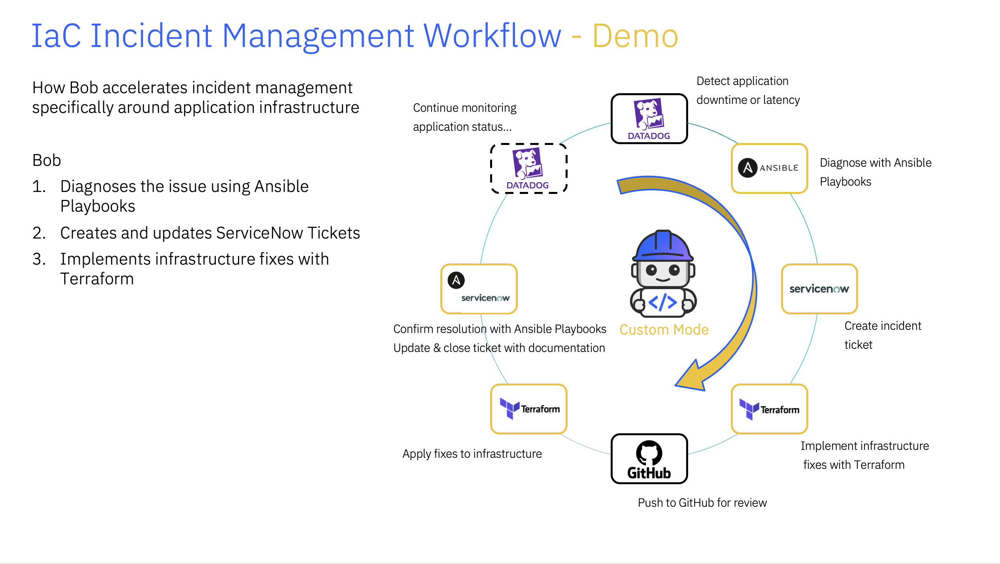

# 🎓 SDLC Incident Management Lab with Bob

A hands-on demonstration of AI-assisted incident management using Bob, ServiceNow, Ansible, and Terraform.



## 📋 Lab Overview

In this lab, participants will:

1. Deploy and explore a working Bank App
2. Teach Bob the team’s SRE workflow by creating a reusable SRE Delivery Mode
3. Give Bob reusable Terraform, Ansible, and ServiceNow guidance
4. Design and provision new Redis infrastructure with Terraform
5. Detect, document, and safely reconcile infrastructure drift
6. Experience a simulated production incident causing application performance degradation
7. Use Bob to diagnose the issue and propose a capacity-based remediation
8. Review and approve the Terraform plan before applying infrastructure changes
9. Track findings, actions, and resolution details in ServiceNow
10. Verify the remediation and complete the incident management workflow
`

## 👨‍🏫 Instructor Setup

During the demo, Bob will modify a few files. To preserve the initial state for repeated run-throughs, either use git branch or zip-extract.

---

### Option 1: Use a Git Branch (Recommended)

Create a demo branch to preserve the initial state:

```bash
# Create and switch to demo branch
git checkout -b demo-session-1

# Run the lab...
# (participants make changes, Bob modifies infrastructure)

# After demo, revert to clean state
git checkout main
git branch -D demo-session-1

# Ready for next session
git checkout -b demo-session-2
```

**Benefits:**
- ✅ Quick reset between sessions
- ✅ Can review changes made during demo
- ✅ No need to re-clone repository
- ✅ Preserves git history

### Option 2: Zip and Extract

Create a clean copy for each session:

```bash
# Before first demo
cd ..
zip -r sdlc-lab-clean.zip tickets-resolution-workflow/

# For each new session
unzip sdlc-lab-clean.zip -d demo-session-1
cd demo-session-1/tickets-resolution-workflow
# Run the lab...

# After demo, delete and extract fresh copy
cd ../..
rm -rf demo-session-1
unzip sdlc-lab-clean.zip -d demo-session-2
```

### For Terraform and Ansible specific use cases
See the [./TF-Ansible-drilldown](./TF-Ansible-drilldown/), which takes a modified path from the original lab to highlight Ansible and Terraform capabilities, including pulling Ansible roles/modules from a remote repo. Currently this asset is just a demo but feel free to contact me @Liam Patty with questions.

## 📖 Getting Started

### Prerequisites
- Docker/Colima running
- Terraform installed
- Ansible installed
- Node.js v20+ (for MCP servers)
- ServiceNow developer instance
- Bob access

**[→ Start the Lab Walkthrough](Lab.md)**

The Lab.md file contains comprehensive step-by-step instructions including:
- Environment setup and prerequisites
- Detailed walkthrough of each phase
- Architecture diagrams (before and after resolution)
- Troubleshooting tips

For a deeper dive on modes, check out the [Draft - Modes mini-lab](Modes-Lab.md).


---

Recorded demo: https://ibm.box.com/s/lrg5w4xm6skjdki6igbmg4hzyk7ymv4h