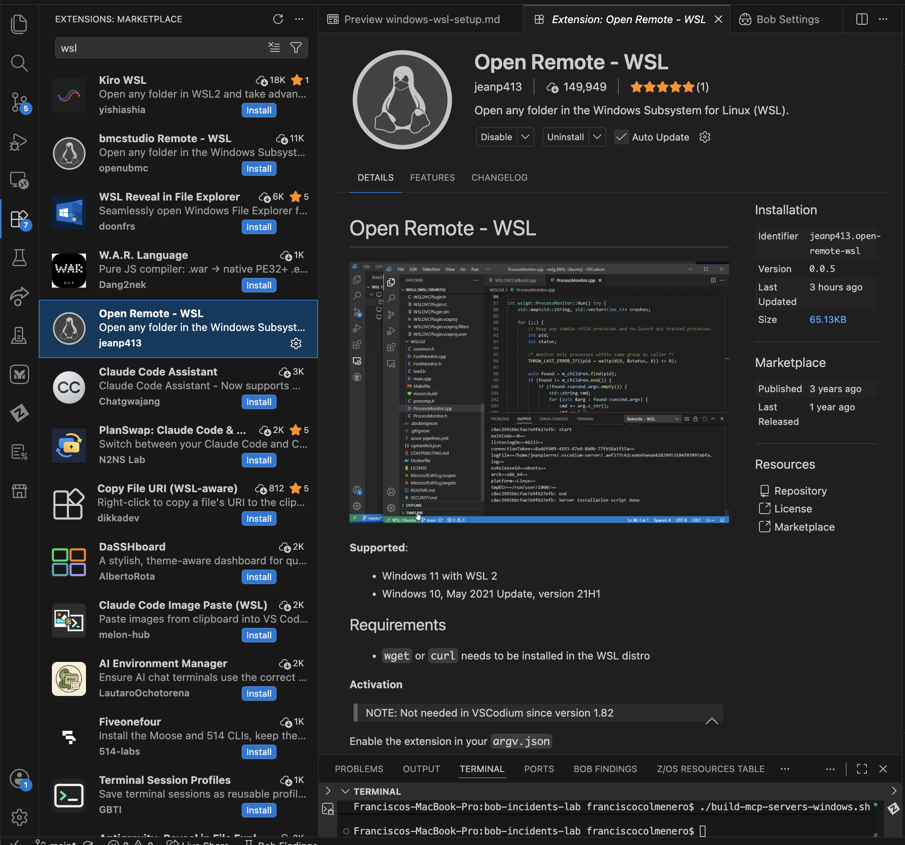
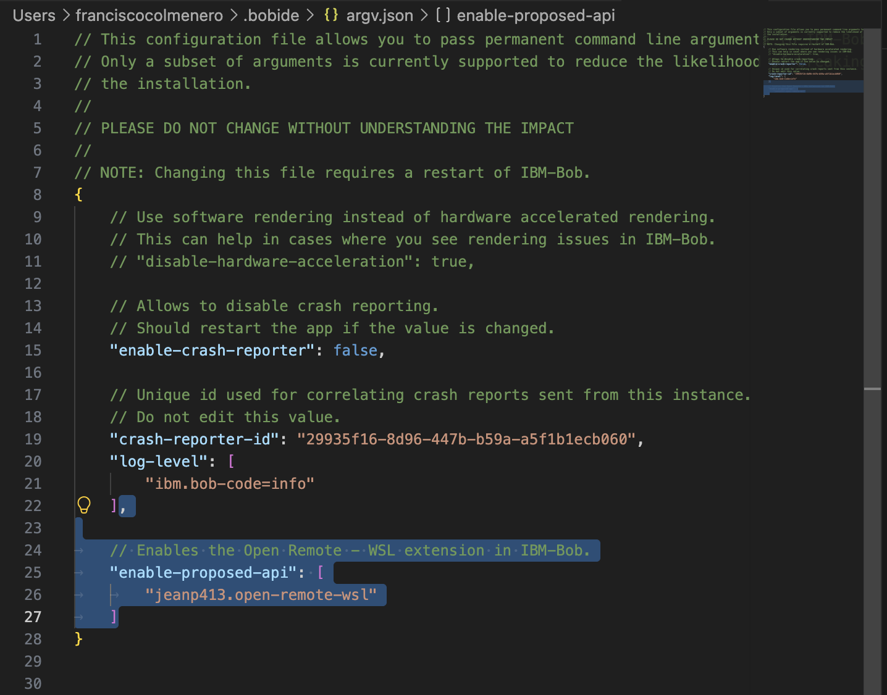

## Windows Backup Setup: Run the Lab Through WSL

Use this option only when Ansible does not run correctly from the normal Windows environment.

**Important:** Opening a WSL terminal tab is not enough by itself. Bob must also execute its commands in the same WSL environment. Complete the validation section before continuing with the lab.

### 1. Install WSL and Ubuntu

1. Open **PowerShell as Administrator**.
2. Run:

   ```powershell
   wsl --install
   ```

3. Restart Windows when prompted.
4. Open **Ubuntu** from the Windows Start menu.
5. Create the Linux username and password requested during first launch.

Confirm that WSL is available:

```powershell
wsl --list --verbose
```

Confirm that the Ubuntu distribution is using WSL 2.

### 2. Configure Docker Desktop for WSL

1. Open **Docker Desktop**.
2. Open **Settings**.
3. Under **General**, enable **Use the WSL 2 based engine**.
4. Open **Resources > WSL Integration**.
5. Enable integration for the Ubuntu distribution.
6. Select **Apply & Restart**.

Open Ubuntu and verify Docker access:

```bash
docker ps
```

Docker should return running containers or an empty list without an error.

### 3. Install the Lab Tools Inside WSL

Run these commands from Ubuntu:

```bash
sudo apt update
sudo apt install -y git ansible nodejs npm curl unzip
```

Install Terraform using the HashiCorp package repository if Terraform is not already available inside WSL.

Verify the tools:

```bash
git --version
ansible --version
node --version
npm --version
terraform version
docker ps
```

All commands must complete successfully before continuing.

### 4. Clone the Repository Inside WSL

Keep the repository in the WSL Linux file system rather than under `C:\`.

```bash
mkdir -p ~/bob-labs
cd ~/bob-labs
git clone <INSERT_REPOSITORY_URL>
cd <CLONED_REPOSITORY_FOLDER>
```

Confirm that you are at the repository root:

```bash
pwd
ls -la
```

You should see repository items such as:

- `.bob`
- `demo-scripts`
- `Lab.md`

### 5. Install and Enable the Open Remote - WSL Extension in Bob

Bob does not include the native Microsoft WSL extension, so use **Open Remote - WSL** by **jeanp413**.



1. In Bob, open the **Extensions** view.
2. Search for **Open Remote - WSL** and install the version published by **jeanp413**.
3. Press `Ctrl + Shift + P` and run **Preferences: Configure Runtime Arguments**.
4. In the `argv.json` file that opens, add this entry inside the outer braces:

   ```json
   "enable-proposed-api": [
       "jeanp413.open-remote-wsl"
   ]
   ```

   If the file already has other entries, add a comma after the entry above this one.




5. Save the file and fully close and reopen Bob.

### 6. Open the Repository in Bob Through WSL

1. Press `Ctrl + Shift + P`, type **WSL**, and select **Connect to WSL**. If you have more than one distribution, use **Connect to WSL using Distro** and choose **Ubuntu**.
2. Wait for the new Bob window to finish connecting. The bottom left corner of Bob should show **WSL: Ubuntu**.
3. In the connected window, select **File > Open Folder**.
4. Enter the Linux path to the repository:

   ```text
   /home/<LINUX_USERNAME>/bob-labs/<CLONED_REPOSITORY_FOLDER>
   ```

5. Select **OK**.
6. Confirm that `.bob`, `demo-scripts`, and `Lab.md` appear directly in the file explorer.

**Important:** Do not open the folder through a `\\wsl$\...` path from a normal Bob window. That opens the files but Bob still runs commands in Windows. Also do not open only the parent `bob-labs` folder. Bob must be opened at the root of the cloned repository.

### 7. Open a Terminal in Bob

1. At the top of Bob, select **Terminal > New Terminal**.
2. The terminal should open as a Linux bash shell in the cloned repository.

Run:

```bash
pwd
uname -s
which ansible
which terraform
which node
which docker
```

Expected checks:

- `pwd` points to the cloned repository under `/home/...`
- `uname -s` returns `Linux`
- Each `which` command returns a Linux path

### 8. Confirm Bob Can Run Commands Through WSL

Ask Bob:

```text
Run pwd, uname -s, which ansible, which terraform, which node, and docker ps. Do not change any files. Show me the complete output.
```

Continue only if Bob reports:

- A repository path under `/home/...`
- `Linux` from `uname -s`
- Valid Linux paths for Ansible, Terraform, Node.js, and Docker
- Successful Docker output

**Stop checkpoint:** If Bob returns a Windows path such as `C:\...`, reports PowerShell, or cannot find Ansible, then Bob is not executing inside WSL. Do not continue with the lab using this setup.

### 9. Configure and Build the Lab

From the Bob terminal at the repository root, configure the root `.env` file:

```text
SERVICENOW_INSTANCE=dev12345
SERVICENOW_USERNAME=
SERVICENOW_PASSWORD=
```

Run the MCP setup script:

```bash
./build-mcp-servers.sh
```

Update `.bob/mcp.json` with absolute WSL paths. WSL paths should use this format:

```text
/home/<LINUX_USERNAME>/bob-labs/<CLONED_REPOSITORY_FOLDER>/...
```

Do not use Windows paths such as `C:\Users\...` in the WSL configuration.

Confirm that the ServiceNow, Ansible, and Terraform MCP servers show a green status in Bob before continuing.

### 10. Final Environment Check

Run from the Bob terminal:

```bash
docker ps
terraform version
ansible --version
node --version
```

If all four commands complete successfully and Bob passed the command test in Step 8, return to the main lab and continue with Part 2.

### Troubleshooting

#### Connect to WSL does not appear in the Command Palette

Confirm that `jeanp413.open-remote-wsl` is listed under `enable-proposed-api` in `argv.json`, then fully close and reopen Bob.

#### 